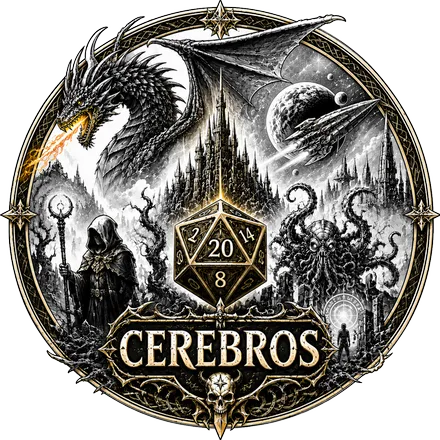

# Cerebros Soundboard

Klangkulissen, Musik und Soundeffekte für Tabletop-Rollenspiele – gebaut für das iPad.

Das Cerebros Soundboard ist eine Web-App (PWA): Man öffnet sie in Safari, legt sie auf den Home-Bildschirm
und nutzt sie dann wie eine normale App – im Vollbild und offline. Ein Mac, Xcode oder der App Store
sind nicht nötig.

## Funktionen

- **Szenen** (z. B. Taverne, Nächtlicher Wald, Verfluchte Krypta, Kampf …): Antippen wählt die Szene aus und stoppt eine laufende Szene; gestartet wird mit „Starten“, damit du in Ruhe vorbereiten kannst.
- **Pro Szene einstellbar:**
  - **Musik:** *Keine*, *Unheimlich* oder *Action*. Für jede Musikart lässt sich die Quelle wählen: eingebaute Musik, eigene Audiodatei oder eine **Spotify**-Playlist.
  - **Hintergrundgeräusche** (Taverne, Lagerfeuer, Bach, Meer, Höhle, Verlies, Nacht- und Tagwald …) – beliebig viele gleichzeitig, jede mit eigener Intensität.
  - **Intensität** der ganzen Szene: *Ruhig*, *Normal*, *Intensiv* (beeinflusst Dichte und Lautstärke aller Geräusche und die Energie der Musik).
  - **Wetter:** Regen, Wind, Gewitter, Schneesturm – beliebig kombinierbar, jedes mit eigenem Stärke-Regler.
  - **Nebengeräusche:** ausgewählte Einzelgeräusche erklingen zufällig „aus der Ferne“ (z. B. Wolfsgeheul im Nachtwald), Häufigkeit einstellbar.
- **Soundboard für Einzelgeräusche:** Schrei, Böses Lachen, Kichern, Wolfsgeheul, Rabe, Geisterstöhnen, Knurren, Knarrende Tür, Klopfen, Schwertklirren, Explosion, Donner, Zauber, Herzschlag, Glockenschlag. Pro Szene lassen sich Favoriten festlegen.
- **Bibliothek frei bearbeitbar:** Alle Sounds – auch die eingebauten Grundsounds – lassen sich umbenennen, mit einem anderen Symbol versehen, durch eine eigene Audiodatei ersetzen (Szenen bleiben verknüpft) oder löschen. Gelöschte oder veränderte Grundsounds lassen sich jederzeit wiederherstellen.
- **Erweiterbar:** neue Szenen anlegen, duplizieren, löschen; eigene Audiodateien (MP3, M4A, AAC, WAV, OGG, OPUS, FLAC …) in jede Kategorie importieren. OGG/OPUS-Dateien, die das iPad nicht selbst abspielen kann, werden beim Import einmalig in WAV umgewandelt (dadurch größer im Speicher) – als Musik, Hintergrund, Wetter oder Einzelgeräusch.
- **Mischpult:** getrennte Lautstärken für Musik, Hintergrund, Wetter und Einzelgeräusche; „Alles stoppen“-Knopf.
- **Datensicherung:** Szenen und eigene Sounds als Datei exportieren und auf einem anderen Gerät wieder einlesen.

Alle eingebauten Klänge werden live mit der Web-Audio-API erzeugt (Synthese). Dadurch gibt es keine
Lizenzfragen und die App ist winzig. Für noch realistischere Klänge kannst du jederzeit eigene Aufnahmen
importieren, z. B. von [freesound.org](https://freesound.org), [tabletopaudio.com](https://tabletopaudio.com)
oder [pixabay.com](https://pixabay.com/sound-effects/) (Lizenzen beachten).

## Auf dem iPad installieren

1. App veröffentlichen (siehe unten) und die Adresse in **Safari** öffnen.
2. **Teilen** → **Zum Home-Bildschirm**.
3. Das Cerebros Soundboard über das neue Symbol starten.

Tipps für den Spieleabend:
- Das iPad nicht in den Ruhezustand gehen lassen – die App hält den Bildschirm während der Wiedergabe wach (Einstellung).
- Ist „Mit anderen Apps mischen“ aktiv (nötig für Spotify), beachtet das iPad den Stumm-Schalter.
- Für Bluetooth-Lautsprecher einfach das iPad wie gewohnt verbinden.

## Veröffentlichen (GitHub Pages)

Die App besteht nur aus statischen Dateien. Der Workflow `.github/workflows/pages.yml` veröffentlicht sie
automatisch, sobald Änderungen auf `main` landen:

1. Im Repository **Settings → Pages → Build and deployment → Source: GitHub Actions** wählen.
2. Den Branch nach `main` mergen. Die Adresse lautet dann `https://<benutzer>.github.io/<repository>/`.

> Hinweis: GitHub Pages für private Repositories erfordert einen kostenpflichtigen GitHub-Plan.
> Alternativ funktioniert jeder andere statische Hoster mit HTTPS (z. B. Netlify, Cloudflare Pages).

Lokal testen: `npx http-server .` und `http://localhost:8080` öffnen.

## Spotify verbinden

Die App steuert über die offizielle Spotify-Web-API die **Spotify-App** (Spotify Connect). Die Musik
läuft also in der Spotify-App auf dem iPad (oder z. B. auf einem Spotify-fähigen Lautsprecher), während
das Soundboard Geräusche darüber mischt. Voraussetzung ist **Spotify Premium**.

Einmalige Einrichtung:

1. Auf [developer.spotify.com/dashboard](https://developer.spotify.com/dashboard) anmelden und **Create app** wählen (Name beliebig, API: *Web API*).
2. Als **Redirect URI** die Adresse eintragen, die im Soundboard unter *Einstellungen → Spotify* angezeigt wird (z. B. `https://<benutzer>.github.io/<repository>/`).
3. Die **Client ID** im Soundboard eintragen und auf **Verbinden** tippen.
4. In einer Szene bei *Unheimlich* oder *Action* als Quelle eine Playlist wählen („Meine Playlists laden …“ oder „Spotify-Link einfügen …“).

Falls die Anmeldung in der installierten Home-Bildschirm-App nicht zurückkehrt: Die App in Safari
öffnen, dort verbinden, unter *Einstellungen → Spotify* den **Verbindungscode kopieren** und ihn in der
installierten App unter „Verbindungscode einfügen“ eintragen.

Wird kein Gerät gefunden, die Spotify-App kurz öffnen und einen Titel anspielen – iOS beendet Spotify
nach einer Weile im Hintergrund.

## Design

Das Erscheinungsbild orientiert sich an der Logtown-Kampagne: Schiefer und Nebel, eiserne Linien, knochenfarbene Schrift und das Glutlicht der Fenster an der Steilküste als einziger warmer Akzent. Überschriften in Cinzel, Text in EB Garamond; Symbole sind entsättigt und glimmen nur, wenn etwas aktiv ist. Schriften und Bilder liegen lokal bei, damit die App offline funktioniert.

## Aufbau

| Datei | Inhalt |
| --- | --- |
| `index.html`, `css/style.css` | Grundgerüst und Gestaltung (für Touch und iPad optimiert) |
| `js/app.js` | Oberfläche: Szenen, Soundboard, Bibliothek, Einstellungen |
| `js/player.js` | Szenen-Player: startet/blendet Ebenen, Wetter, Musik und Nebengeräusche |
| `js/engine.js` | Audio-Engine: Mischpult, Hall, Überblendungen, Dateiwiedergabe |
| `js/synth.js` | Alle eingebauten, synthetisch erzeugten Klänge |
| `js/store.js` | Datenmodell, Beispielszenen, Sicherung |
| `js/spotify.js` | Spotify-Anmeldung (PKCE) und Fernsteuerung |
| `js/db.js` | Speicherung in IndexedDB |
| `js/decode.js` | Prüft importierte Dateien, wandelt OGG/OPUS bei Bedarf um |
| `js/vendor/` | OGG-Decoder ([wasm-audio-decoders](https://github.com/eshaz/wasm-audio-decoders), MIT) |
| `fonts/`, `img/` | Schriften Cinzel und EB Garamond (SIL Open Font License), Hintergrundbild der Logtown-Kampagne |
| `sw.js` | Service Worker für den Offline-Betrieb |

Neue eingebaute Klänge lassen sich ergänzen, indem man in `js/synth.js` einen Generator schreibt
(`LOOP_GENERATORS` oder `ONESHOT_GENERATORS`) und ihn in `BUILTIN_SOUNDS` in `js/store.js` einträgt.
Nach Änderungen an den Dateien die `VERSION` in `sw.js` erhöhen, damit installierte Apps aktualisiert werden.
